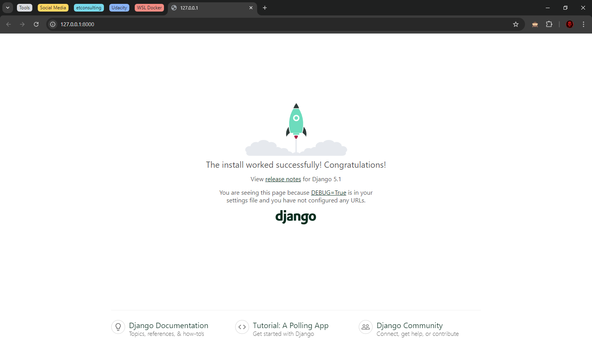

# Learning Django @2024
A simple project to learn Django

> **Note :**
> - I will rely on [Create a Web Application With Django](https://openclassrooms.com/en/courses/6967196-create-a-web-application-with-django) course from Openclassrooms
    for this mini-project and then summarize what I have learned.
>
> - I will use [ChatGPT](https://chat.openai.com/) to provide a summary with a simple storytelling technique, making
    this document accessible and easy to understand even for novices.

## Chapter 1 : Intro

Let me take you on a journey into the world of **Django**, a powerful open-source **Python framework** built for web development. 🌍🐍

**Django** is designed to help developers create web applications quickly, without sacrificing quality. ⚡ Throughout this course, you'll be guided step-by-step in creating a real, fully functional web app using Django. 🚀

We begin by building the foundation of your app with the **MVT** (Models, Views, and Templates) architecture. 🛠️ The **model** handles your data, **views** control what the user sees, and **templates** determine how it’s presented. 💾👁️🎨

Next, you’ll learn to manage data through Django's built-in admin interface. 🛡️ You'll then move on to developing your own interface to Create, Read, Update, and Delete (CRUD) data. 🔄

By the end of the course, you’ll be equipped with the skills to start building and managing Django apps, ready to launch your career as a Django web developer. 💻✨

### Learn From a Professional Scenario
In this course, you will create a full web application from start to finish. The context of this web application is outlined below:

You’ve been asked to create a proof of concept for a new web app: the Merch Exchange. This will be an app where people can list various collectible music merchandise like records, posters, and gig tickets. In addition, users should be able to post listings of the merch they would like to sell.

### Coming Back to the Project After a Restart

You should always have your `virtual environment activated` during development. For example, if you restart your machine and then come back to the project, you can activate your virtual environment by first making sure you’re in the directory that contains your  env  directory and the running: 

```bash
source env/bin/activate
```
### If Your Site Has Stopped Working

Sometimes while you're coding, you might notice that your Django development `server stops working`. But don’t worry—this happens often during development. 

**Here's why:**

The development server is set to automatically reload whenever it detects that you’ve saved changes to your files. This is helpful most of the time, but if your code is incomplete, the server might try to reload unfinished work and crash. 💥

Some IDEs, like PyCharm, even have an `auto-save` feature that can cause the server to reload without you manually saving your work. The good news is that the server process usually waits for your next code change and starts up again. 🔄

However, sometimes **the server can't recover from an error**. In that case, finish the code you're working on and follow these steps:

1. Get back to the terminal prompt by pressing `Ctrl + C` to stop the server. ⌨️
2. Make sure you’re in the right directory—use `ls` to check if you can see the `manage.py` file. If not, navigate to the correct folder using `cd`. 📂
3. Once you’re in the right directory, restart the server with `./manage.py runserver`. 🚀

If you don’t see `manage.py`, you're likely in the wrong directory. Use `ls` and `cd` to find it and restart your server.

---

## Chapter 2 : SetUp the environment

### 2.1 Install Django With pip

Before you can start building a Django web application, you need to install Django. Here's how you can do it, step by step:

1. **Open a terminal**: This is where you'll be running commands to set up Django. 💻

2. **Navigate to your projects directory**: Go to the folder where you typically store your projects. If you don’t have one, now’s a great time to create it! 🗂️

   Example:
   ```
   → cd projects/
   ```

3. **Create a directory for your Django project**: This will house all the files related to your web app. After creating the directory, navigate into it. 📁

   ```
   → mkdir django-web-app
   → cd django-web-app
   ```

4. **Initialize Git** (if you're using it): This step is optional, but highly recommended for tracking changes in your project. 🔄

   ```
   → git init
   ```

5. **Set up a virtual environment**: Virtual environments help keep your project’s dependencies isolated from other projects. 🌐

   ```
   → python -m venv env
   ```

6. **Activate the virtual environment**: This step ensures that any Python packages you install will be restricted to this project. 🛠️

   ```
   → source env/bin/activate
   ```

7. **Install Django using pip**: Now that your environment is ready, install Django using pip, the Python package manager. 📦

   ```
   (env) → pip install django
   ```

8. **Track your dependencies**: Create a `requirements.txt` file to list all the packages your project relies on. This makes it easier to recreate the environment in the future. 📑

   ```
   → pip freeze > requirements.txt
   ```

Now Django is installed, and you're all set to start building your web application! 🚀

---

## Chapter 3: Set Up a New Django Project

After setting up your environment and installing Django, it’s time to create the foundational structure for your web application.

### 3.1 Generate the Project Structure

Now that Django is installed, the next step is to generate the necessary files for your project. Instead of manually creating folders and files, Django provides a command-line tool to automate this process. 🎉

In the terminal, navigate to your project directory (where you created your `django-web-app` folder). Use the following command to create the base structure of your project:

```bash
django-admin startproject merchex
```

This command generates essential project files, including a new directory named `merchex` and a script called `manage.py`. The `merchex` directory will hold the main settings and configuration files for your app, while `manage.py` is the go-to tool for running Django commands. 

With just one command, you’ve laid the groundwork for your Django project! 🚀

### 3.2 Running the Development Server

With the basic structure in place, you can now launch the project on a development server. This allows you to see your application live, even if it's just the default Django page for now. 🌐

To start the server, use the following command:

```
python manage.py runserver
```

Once executed, Django will provide a local web address **([http://127.0.0.1:8000/](http://127.0.0.1:8000/))** where you can preview your app in a browser. 

At this stage, you should see the default Django page confirming that your project is running successfully. 🎨



### 3.3 Setting Up the Database

When you first start the server, Django may alert you about pending database migrations. These migrations are necessary to set up the application’s database, which will eventually store all your data.

To apply these migrations and create the database, run:

```
python manage.py migrate
```

This will create a database file named `db.sqlite3`, which holds all the data for your project. It’s a good practice to add this file to your `.gitignore` so it isn’t tracked in your version control system. 📂

### 3.4 Creating Your First App

In Django, a project is made up of several "apps," each focusing on a specific part of your application. For example, to handle **merchandise listings**, you’ll create an app called `listings`. This modular approach keeps your code organized as your project grows. 🛠️

To create the `listings` app, use:

```
python manage.py startapp listings
```

A new folder named `listings` will appear, containing the necessary files to start developing features related to merchandise listings.

### 3.5 Installing the App

After creating your app, you need to tell Django about it. Open the `settings.py` file inside the `merchex` directory and find the `INSTALLED_APPS` list. Add `'listings'` to this list to ensure Django includes it when running the project.

```python
INSTALLED_APPS = [
    'django.contrib.admin',
    'django.contrib.auth',
    'django.contrib.contenttypes',
    'django.contrib.sessions',
    'django.contrib.messages',
    'django.contrib.staticfiles',
    
    # New Apps
    'listings',
]
```

Your app is now officially part of the project, and you're ready to start building your first features! 🎉

---

## Chapter 4: Serve Content With a View

Now that your Django project is set up, it's time to bring it to life by displaying content on a webpage. 🚀 In this chapter, you’ll learn how to create web pages by using *views* and *URL patterns*, which are fundamental parts of Django’s architecture.

### 4.1 Create Your First View

In Django, a *view* is a Python function that takes a user’s request and sends back a response. This is how content is served to users. Let’s start by creating a simple view that displays a message.

1. **Open `views.py`**: Inside the `listings` app, locate `views.py`. Replace the default comment with a new function called `hello`, and import the `HttpResponse` class.

```python
from django.http import HttpResponse

def hello(request):
    return HttpResponse('<h1>Hello Django!</h1>')
```

🎉 You've just created your first view! This function will send back an HTML header saying "Hello Django!" whenever it's accessed.

### 4.2 Connect the View to a URL

Next, you need to connect this view to a specific URL. This is done by creating a *URL pattern*.

2. **Edit `urls.py`**: Open `merchex/urls.py` and add a new path that links the `/hello/` URL to the `hello` view. Don’t forget to import the view from the `listings` app.

```python
from django.urls import path
from listings import views

urlpatterns = [
    path('admin/', admin.site.urls),
    path('hello/', views.hello),
]
```

Now, when you visit ([http://127.0.0.1:8000/hello/](http://127.0.0.1:8000/hello/)) in your browser, your `hello` view will display its message. 🎉

### 4.3 The Role of URLs in Django

Every time a user interacts with your site, it begins with a URL. Django uses these URLs to match user requests with the correct view. You’ve already created one URL pattern, but let’s create another for an "About Us" page.

3. **Add a New View**: In `views.py`, add a second function called `about` to handle requests for the "About Us" page.

```python
def about(request):
    return HttpResponse('<h1>About Us</h1> <p>We love merch!</p>')
```

4. **Update URLs**: Add this new view to your URL patterns by editing `urls.py`.

```python
urlpatterns = [
    path('admin/', admin.site.urls),
    path('hello/', views.hello),
    path('about-us/', views.about),
]
```

Once done, visit ([http://127.0.0.1:8000/about-us/](http://127.0.0.1:8000/about-us/)) to see the "About Us" page! 🖥️

### 4.4 Understanding Views and URL Patterns

Views and URL patterns work together to make your Django site interactive. The URL pattern tells Django which view to call based on the user’s request. While it may seem like magic when the view is automatically executed, this is actually Django handling everything behind the scenes. 🧑‍💻

### 4.5 Try It Yourself

Now that you’ve created two pages, it’s time to practice by adding more. Create two new pages: one for **merchandise listings** and one for **contact information**. Follow the same steps: define views in `views.py` and link them to URLs in `urls.py`. 

By the end of this chapter, you’ll have multiple pages running on your site, and you’ll be well on your way to mastering Django! 🎉

---

## Chapter 5: Save Data to a Database With a Model and a Migration

Now that your Django project is up and running, it’s time to add some life by saving real data in the database. In this chapter, we will explore how Django uses **models** to represent entities and how **migrations** help us manage the database schema.

### 5.1 Creating a Model

In any web application, storing data is essential. Imagine you're building an app that tracks **bands** and their merchandise. Each of these is an entity, and in Django, you represent these entities with a **model**.

A model is like a blueprint, defining the information you want to store about an entity. For instance, the **Band** model might have fields like the band's **name**, **genre**, and the year they became active. These fields store the details you need.

**Here’s the cool part:** Django makes it super easy to create models using Python classes! 🎉 You define a class for each entity, and Django takes care of everything else, like saving data to the database. 

### 5.2 Adding Your First Model

To create the **Band** model, you simply edit the `models.py` file in your app. You define a class that inherits from Django's `models.Model`, which brings all the tools needed to interact with the database.

For example:
```python
class Band(models.Model):
    name = models.fields.CharField(max_length=100)
```
In this case, we’ve created a field `name` to store the band’s name. Django will take care of adding this field to the database for us. 🎸

### 5.3 Applying Migrations to the Database

Now that you've defined the **Band** model, it’s time to make sure the database knows about it. This is where **migrations** come in. Migrations are Django’s way of translating your model changes into database schema updates. 🛠️

First, you need to generate a migration file that tells Django what changes to make:
```bash
python manage.py makemigrations
```
Django creates a migration file for the **Band** model. To apply this migration and update the database schema, run:
```bash
python manage.py migrate
```
Now, the database is ready to store bands! 🎉

### 5.4 Saving Data in the Django Shell

With the **Band** model and database schema set up, you can now add data. One way to do this is through the **Django shell**, which allows you to interact with your app's models in real-time.

Open the shell:
```bash
python manage.py shell
```
Create a new band:
```python
from listings.models import Band
band = Band(name='De La Soul')
band.save()
```
The `save()` method stores this new band in the database. Just like that, you’ve saved your first object to the database! 🎉

### 5.5 Displaying Data in the View

Now that the **Band** objects are stored in the database, how do we display them on a webpage? Simple. In your view, use `Band.objects.all()` to retrieve all bands and pass them to the template.

Here’s an example in your `views.py`:
```python
from listings.models import Band

def hello(request):
    bands = Band.objects.all()
    return HttpResponse(f"""
        <h1>Hello Django!</h1>
        <p>My favorite bands are:</p>
        <ul>
            <li>{bands[0].name}</li>
            <li>{bands[1].name}</li>
            <li>{bands[2].name}</li>
        </ul>
    """)
```
This code grabs the list of bands from the database and displays their names in an HTML list. 🎶

### 5.6 Now It’s Your Turn!

Try adding a new **listing** model for merchandise items. Give it a `title` field and practice using migrations to add it to the database. Then, use the Django shell to add a few **listing** objects and display them in your app.

---

## Chapter 6: Clean Separation of Logic and Presentation With Django Templates

After saving data to the database in the previous chapter, it’s time to improve how we display that data. Right now, our views are cluttered with HTML mixed into Python code. This can quickly become messy and hard to maintain, especially as your application grows. 

In this chapter, we’ll solve this problem by separating the logic from the presentation using **Django templates**.

### 6.1 The Problem with HTML in Views

When you mix your app’s logic (like retrieving data from the database) with HTML presentation in your views, the code becomes difficult to manage. 

For example, if you want to update the design of a webpage, you’ll need to dig through the Python code, which can be confusing and error-prone. 

**Here’s the solution:** Django provides a powerful way to separate concerns by using templates for the presentation layer. Templates handle all the HTML, while views focus on logic like fetching data. 🧹✨

### 6.2 Creating and Using a Template

To start cleaning up your views, you need to create a template file for the HTML. This file will be separate from the Python code, ensuring a clear distinction between what is displayed and how it’s processed. 📝💻

1. **Create the Template File**  
   First, create a new HTML file for your view in a `templates` folder (e.g., `listings/templates/listings/hello.html`). Inside this file, you can write your HTML as usual, without worrying about Python code. 🗂️📄

2. **Refactor the View**  
   Next, update the view in `views.py` to use the template. Instead of writing HTML in the view itself, you’ll use Django’s `render()` function to return a rendered template. This keeps the view focused on fetching data. Here’s an updated view:
   ```python
   from django.shortcuts import render
   from listings.models import Band

   def hello(request):
       bands = Band.objects.all()
       return render(request, 'listings/hello.html', {'bands': bands})
   ```
   🎨🔄

### 6.3 Using Template Variables

Once you’ve refactored the view, you’ll need to display the data in your template. Django makes this easy with **template variables**. For example, to show the name of each band, use double curly braces (`{{ }}`) in the HTML:
```html
<ul>
    
        <li>{{ band.name }}</li>
    
</ul>
```
Now, Django will replace `{{ band.name }}` with the actual band names from the database. 🎶🎤

### 6.4 Filters and Logic in Templates

Django templates also allow you to apply filters and use basic logic. For example, you can use the `upper` filter to display band names in uppercase:
```html
<li>{{ band.name|upper }}</li>
```
You can also add conditional logic, like an `if` statement, to customize the output based on the data:
```html

    <p>Here are my favorite bands:</p>

    <p>No bands to display.</p>

```
💡🔄

### 6.5 A Clean and Maintainable Approach

By using templates, you keep your views simple and focused on data processing. The templates take care of rendering the HTML, making your app much easier to maintain and scale as you add more features. 🚀💻

🎉 You’re now equipped to build web pages that display dynamic content while keeping your code clean and organized!

---

## Chapter 7: Add Structure and Style to Your Site With a Base Template, CSS, and Static Files

Building on the foundation of clean logic and presentation from the previous chapter, it’s now time to refine your Django project further. As your app grows, managing multiple templates can become cumbersome, especially with repeated HTML code. 

In this chapter, we'll introduce **base templates**, **static files**, and **CSS**, helping you create a well-structured and visually appealing site. 🎨

### 7.1 The Challenge of Repeated Code

As you develop your app, you’ll notice many templates containing the same HTML structure, like `<html>`, `<head>`, and `<body>`. This repetition not only clutters your code but also makes it harder to manage changes. 

Imagine needing to update the title across several pages! This is where the **DRY principle**—Don’t Repeat Yourself—comes in handy. By utilizing a base template, you can centralize common HTML elements, making your code cleaner and easier to maintain. 🧹

### 7.2 Creating a Base Template

To start, you’ll create a **base template** that contains the shared HTML structure. This base template will serve as a foundation for all your other templates. 

**Here’s how:**

1. **Define Common HTML**  
   Create a new file called `base.html` in your `templates` folder. Include the common elements, such as the `<html>`, `<head>`, and a `` section for unique content:

   ```html
   <!-- listings/templates/listings/base.html -->
   <html>
       <head>
           <title>Merchex</title>
       </head>
       <body>
           
       </body>
   </html>
   ```

2. **Inherit from the Base Template**  
   In your specific templates (like `hello.html`), you’ll now use the `` tag at the top. This tells Django to build upon the base template, allowing you to focus only on the unique content for that page:

   ```html
   <!-- listings/templates/listings/hello.html -->
   

   
   <h1>Hello Django!</h1>
   <p>My favorite bands are:</p>
   <ul>
       
           <li>{{ band.name }}</li>
       
   </ul>
   
   ```

### 7.3 Adding Style with CSS

Now that your structure is solid, it’s time to enhance your site’s appearance with **CSS**. You’ll create a static file for your styles, which will ensure a consistent look across your application. Here’s how:

1. **Create a Static Folder**  
   Inside your app directory, create a folder named `static`, and within it, another folder for your CSS files (e.g., `listings/static/listings/`). 

2. **Link Your CSS File**  
   In your base template, add a `<link>` tag to connect your CSS file. Use Django’s `` tag to ensure the file is correctly located when the site runs:

   ```html
   <link rel="stylesheet" href="" />
   ```
   For the  `static`  tag to work, we first need to `load` it into this template. We do that by adding a  `load`  tag at the very beginning of the file, like this: 
   
   ```html
   
   <html>
   ...
   ```

3. **Create a CSS File**  
   In your `listings/static/listings/` folder, create a file called `styles.css`:

   ```css
   /* listings/static/listings/styles.css */
   body {
       background-color: red; /* Just for testing */
   }
   ```

### 7.4 Ensure Everything Works

Once your CSS file is linked, do a quick test to see if it loads correctly. Start your development server and check if your styles apply. If everything is set up right, you’ll have a stylish site that stands out! 🎉

### 7.5 Update All Templates

With a working base template and CSS, your next task is to ensure all your page templates inherit from the base template. Each template should include the `` and `` tags, keeping your code consistent and easy to manage. 🔧

### 7.6 Recap of MVT Architecture

This chapter reinforces the **MVT architecture**—Models, Views, and Templates—which keeps your application organized. By separating your application into these components, you facilitate teamwork and maintainability. Each developer can focus on their part without worrying about conflicting changes. 

### 7.7 Embracing Server-Side Rendering

Finally, it’s essential to understand the benefits of **server-side rendering**. This approach generates HTML on the server and sends it to the client, making it simpler to build and maintain your app. While client-side rendering is becoming popular, server-side rendering remains a great starting point, especially for proof-of-concept projects.

---

## Chapter 8: Capturing Data with Models and Fields 📋

In this chapter, we dive into **models** and **fields** in Django, focusing on how they help us structure data. Think of a **model** as a blueprint for an entity in your app. 

For example, we used a model for a music band. Each band has different characteristics like a name, genre, and year they were formed. These characteristics are stored in **fields**.

#### Model Example:
```python
from django.db import models

class Band(models.Model):
    name = models.CharField(max_length=100)
    genre = models.CharField(max_length=50)
    year_formed = models.IntegerField()
    is_active = models.BooleanField(default=True)
```

Django provides different field types depending on the kind of data we want to store. Here's how we broke it down:

- **CharField**: For strings like the name and biography.
- **IntegerField**: Perfect for numbers, like the year the band was formed.
- **BooleanField**: A true/false field, used to mark if the band is still active.
- **URLField**: Specifically for web addresses.

Each field can have **options** or **rules**. For example, the name field has a maximum length, and the year must be between 1900 and 2021. If the band doesn't have a homepage, we allow that field to be left blank.

#### Field with Rules Example:
```python
class Band(models.Model):
    name = models.CharField(max_length=100)
    genre = models.CharField(max_length=50)
    year_formed = fields.IntegerField(
        validators=[MinValueValidator(1900), MaxValueValidator(2024)]
    )
    website = models.URLField(blank=True)
```

### Adding Choices 🎛️

For certain fields, like genre, we may want to limit user input to a list of predefined choices (to avoid inconsistencies). Django's `TextChoices` class makes this possible. 

We defined genres such as Hip-Hop, Synth Pop, and Alternative Rock using this feature.

#### Choices Example:
```python
class GenreChoices(models.TextChoices):
    HIPHOP = 'HH'
    SYNTHPOP = 'SP'
    ALTERNATIVEROCK = 'AR'

class Band(models.Model):
    name = models.CharField(max_length=100)
    genre = models.CharField(max_length=2, choices=GenreChoices.choices)
```

### Migrating the Changes 🚀

Once new fields are added to a model, we must update the database to reflect these changes. This is done through a **migration**. 

Think of it as a way to keep the database in sync with the model. The `makemigrations` command checks for changes, and Django will sometimes ask for default values when non-optional fields are added.

#### Migration Commands:
```bash
python manage.py makemigrations
python manage.py migrate
```

### Handling Defaults and Validations 🛠️

When we add new columns to an existing table, Django needs a way to fill in those values for existing records. For example:
- If the **biography** field is added, Django asks for a default value (we used an empty string).
- For **genre**, we chose Hip-Hop as a placeholder.
- The **year_formed** got a default value of 2000.

This way, we ensure every record is complete, even if the new fields were added later.

After that, we can apply the migration with the `migrate` command, and the database will now support the new structure! 🎉

### Conclusion

In this chapter, we learned how to capture data in Django using models and fields, and how to handle migrations and defaults. In the next part, we'll learn how to enforce users to input values in forms and handle data validation more robustly. 🧐

---

## Chapter 9: Perform CRUD Operations in the Django Admin 📊

Following our exploration of **models** and **fields** in the previous chapter, we now turn our attention to the next crucial aspect of data management: **CRUD operations**. 

These four operations—Create, Read, Update, and Delete—are essential for interacting with the data we've structured using Django's models.

### What is CRUD?

CRUD refers to the fundamental actions we can perform on data:

- **Create**: Inserting new records into the database.
- **Read**: Retrieving existing records for display or analysis.
- **Update**: Modifying existing records to reflect changes.
- **Delete**: Removing records that are no longer needed.

Up until this point, we have focused on creating and reading objects in the Django shell. Now, we will learn how to perform all four CRUD operations using Django’s built-in Admin interface, which simplifies these tasks significantly.

### Discovering the Django Admin Site

Django's Admin site is a powerful feature that allows developers and administrators to manage their models easily. To get started, we first create a superuser account with the following command:

```bash
python manage.py createsuperuser
```

This superuser will have the highest level of permissions, allowing us to access all features of the Admin site. After creating the superuser, we register our models—like the `Band` model—in the `admin.py` file. 

This registration makes the model manageable from the Admin interface:

```python
from django.contrib import admin
from listings.models import Band

admin.site.register(Band)
```

Once we run our development server and navigate to the Admin site at `http://127.0.0.1:8000/admin/`, we can log in and start managing our models.

### Performing CRUD Operations

1. **Create**: By clicking the “+ Add” link for our `Band` model, we access a form to enter details for a new band. This form incorporates validation to ensure data integrity, prompting us with errors if required fields are left blank.

2. **Read**: After creating a band, we’re redirected to a list view displaying all bands in our database. This action represents the “Read” operation, where we can visualize the data we have collected.

3. **Update**: To update an existing band, we can click on it from the list, change the details, and click “Save.” This operation modifies the existing record, showcasing the “Update” aspect of CRUD.

4. **Delete**: If we wish to remove a band, we select the band, choose “Delete selected bands” from the dropdown menu, and confirm our choice. This completes the “Delete” operation, ensuring that outdated records are removed from our database.

### Customizing the Admin Interface

The Django Admin site is primarily designed for administrators, but we can customize it to improve usability. For instance, we can enhance how the `Band` model displays in the Admin interface by modifying its string representation:

```python
class Band(models.Model):
    ...
    def __str__(self):
        return self.name
```

Additionally, we can customize the admin view by creating a `BandAdmin` class that specifies which fields to display:

```python
class BandAdmin(admin.ModelAdmin):
    list_display = ('name', 'year_formed', 'genre')
    
admin.site.register(Band, BandAdmin)
```

With these adjustments, the Admin interface becomes more intuitive, providing clear information at a glance.

### Try It Yourself!

Now that you’re familiar with the CRUD operations in Django, it’s time to put your knowledge into practice. Register another model, such as `Listing`, in the Admin site and experiment with creating, reading, updating, and deleting records. Don’t forget to revisit and refine your existing `Band` entries, ensuring they contain accurate information.

### Conclusion

In this chapter, we learned how to perform CRUD operations through Django’s Admin site, allowing us to manage our data efficiently. This foundational skill is vital for any web application, enabling effective data manipulation and management. 

As we move forward, we’ll explore how to enhance user interactions further by creating customized forms for front-end use, ensuring a seamless experience for all users. 🚀

---

## Chapter 10: Create Many-to-One Relationships with Foreign Keys 🔗

Building on our knowledge of CRUD operations in the Django Admin, this chapter explores how to connect models together, allowing us to represent relationships in our data. Specifically, we’ll dive into **many-to-one relationships** using **Foreign Keys**.

### Understanding the One-to-Many Relationship 🎶🛍️

Imagine you’re managing merchandise listings for a band, like t-shirts or posters. Each listing belongs to one specific band, but a band can have multiple listings. This is a classic example of a **one-to-many relationship**: one band can have many listings, but each listing belongs to just one band.

For example:
- *De La Soul* might have listings for a tour poster, a t-shirt, and a concert ticket. These three listings are all related to one band—*De La Soul*. 
- But the listings can’t be tied to two bands simultaneously, like *De La Soul* and *Foo Fighters*. Each listing has only one band.

### Using Foreign Keys to Link Models 🗝️

To establish this relationship in Django, we add a **ForeignKey** field to the `Listing` model. This allows each listing to be linked to a specific band.

```python
class Listing(models.Model):
    ...
    band = models.ForeignKey(Band, null=True, on_delete=models.SET_NULL)
```

Here’s what’s happening:
- **`ForeignKey(Band)`**: This tells Django that each `Listing` is related to a `Band`.
- **`null=True`**: This allows us to create a listing even if it’s not linked to a band right away.
- **`on_delete=models.SET_NULL`**: If a band gets deleted, the `band` field in the listing will be set to `null` rather than deleting the listing.

### Updating the Database 🛠️

Once we’ve added the `ForeignKey` field, we need to update the database to reflect this change. We use the migration commands:

```bash
python manage.py makemigrations
python manage.py migrate
```

These commands ensure our models are synchronized with the database, and we can now link bands to their listings.

### Managing Foreign Keys in the Admin Panel 🖥️

With the foreign key in place, the Django Admin panel now offers a dropdown menu when creating or editing a `Listing`. This dropdown allows us to select which band the listing is associated with.

To enhance the Admin interface, we can customize it to display the band alongside each listing:

```python
class ListingAdmin(admin.ModelAdmin):
    list_display = ('title', 'band')
```

Now, in the Admin list view, you’ll be able to see both the listing and the band it’s linked to. This makes it easier to manage and view the relationships between models.

### Conclusion

In this chapter, we’ve taken a significant step by connecting our models through **Foreign Keys**, establishing many-to-one relationships. This allows us to manage more complex data structures, making our app more dynamic and functional.

Now, each listing can be tied to a specific band, making it easier to organize and retrieve related data. 🎉

Next, we’ll explore how to improve user experience further by creating forms that allow users to interact with this connected data on the front end!

---

### Chapter 11: Overcome Common Migration Pitfalls 🚧

As we continue developing Django applications, there’s always a possibility of making mistakes while creating migrations. Don’t worry—there are two effective strategies to correct such issues:

1. **Roll Back the Migration**  
2. **Create a New Migration**

Let’s walk through each of these options.

### 1. Rolling Back an Unwanted Migration ⏪

Imagine you accidentally added a field to the wrong model and ran the migration. In this scenario, if the mistake is **only on your local machine** and hasn't been shared with other developers or pushed to production, the solution is simple—**roll it back**.

Here’s how:
- Use `python manage.py showmigrations` to view all migrations.
- Identify the unwanted migration and its predecessor.
- Run `python manage.py migrate <app_name> <previous_migration>` to roll back the specific migration.
- The migration will be undone, and you can safely delete it from your project.

### 2. Creating a New Migration 🔄

If the migration has already been shared or applied in production, rolling it back is **not an option**. Instead, you’ll need to create a new migration that undoes the unwanted changes.

To do this:
- Modify the model to remove the unwanted changes.
- Run `python manage.py makemigrations` to generate a new migration.
- Apply the new migration with `python manage.py migrate`.

This approach safely reverts the database changes, even on other machines where the initial migration has been applied.

### Handling Migration Conflicts 🔀

When working on a project with multiple developers, you may encounter **migration conflicts**—this happens when different branches add migrations with the same name. For example, two developers might add fields to the same model on different branches.

If Django detects conflicting migrations, you’ll see an error. But fear not! You can resolve this by merging the migrations using `python manage.py makemigrations --merge`. Django will combine the changes, and you can apply the merged migration.

### Conclusion 🛠️

Mistakes in migrations are common, but with the right strategies, they’re easy to fix. Whether you roll back a migration or create a new one, you can keep your database in sync and your project running smoothly. 

And when working in teams, learning to merge migrations will help you avoid conflicts and keep everyone on track. 

Happy coding! 🎉

---

